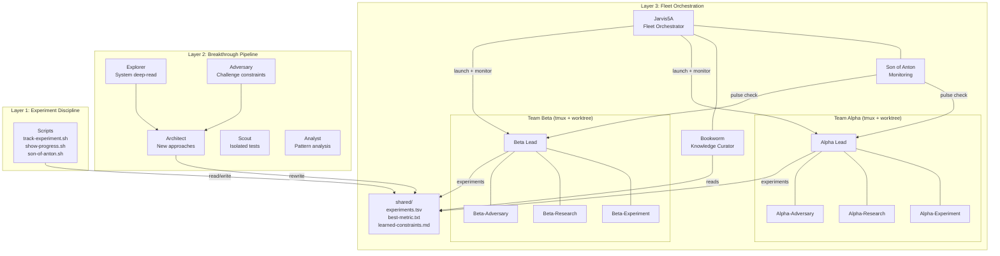

# perf-lab-plugin v3

Autonomous multi-agent performance optimization plugin for Claude Code. Turns any "optimize metric X" problem into a coordinated fleet of research teams that run experiments, share findings, and build institutional memory.

Inspired by Karpathy's autoresearch pattern: single metric, autonomous iteration, never-stop loop. Extended to multi-agent teams with heartbeat monitoring, breakthrough propagation, verified metrics, and a knowledge curator that maintains human-readable research logs.

## Three Layers — Adopt What You Need

Each layer works without the ones above it. Start with Layer 1, add layers when needed.

### Layer 1: Experiment Discipline (single agent)

Track every attempt. Log successes AND failures. Verify results with multi-run testing. Never repeat discarded experiments. Build institutional memory in experiments.tsv and learned-constraints.md.

```
You ──→ Claude ──→ edit code → run tests → log result → repeat
                         │
                   shared/experiments.tsv (append-only log)
                   shared/best-metric.txt (current best)
                   shared/learned-constraints.md (what doesn't work)
```

**Skills:** `/perf-lab:experiment`, `/perf-lab:status`, `/perf-lab:research`
**Scripts:** `track-experiment.sh`, `show-progress.sh`, `search-papers.sh`

### Layer 2: Autonomous Iteration (single agent, unattended)

Sweep runs experiments in a loop. Plateau detection triggers breakthrough sequence (explorer, adversary, architect, rewrite) automatically. Research pipeline feeds fresh ideas. Replay retries old experiments after architecture changes, where some of the biggest wins come from.

**Skills:** `/perf-lab:sweep`, `/perf-lab:plateau`, `/perf-lab:replay`, `/perf-lab:analyze`
**Agents:** `@explorer`, `@adversary`, `@architect`, `@scout`, `@analyst`

### Layer 3: Fleet Orchestration (multi-agent teams)

Jarvis5A orchestrates multiple research teams from the user's session. Each team runs in its own tmux session with its own Agent Team internally. Son of Anton monitors fleet health. Bookworm curates human-readable knowledge. Cross-team communication through shared files. Breakthrough propagation ensures all teams learn from wins.

```
Jarvis5A (user's session — Agent Team: jarvis-command)
├── Son of Anton (teammate — monitoring + alerting)
├── Bookworm (teammate — knowledge curation → shared/knowledge/)
│
├── son-of-anton.sh (bash daemon, tmux: son-of-anton — cheap 60s polling)
│
├── Team Alpha (tmux: alpha, worktree, Agent Team: perf-lab-alpha)
│   ├── Alpha (team lead), Alpha-Experiment, Alpha-Research, Alpha-Adversary
│
├── Team Beta (tmux: beta, worktree, Agent Team: perf-lab-beta)
├── Team Gamma, Delta, Epsilon... (as many as needed)
│
└── shared/ (symlinked across all worktrees)
    ├── experiments.tsv, best-metric.txt, learned-constraints.md
    ├── agent-pulse/*.json (heartbeats)
    ├── jarvis-inbox/ (bash monitor → Jarvis)
    ├── messages/ (cross-team broadcasts)
    ├── knowledge/ (Bookworm's output)
    │   ├── chronicle.md, techniques.md, constraints.md
    │   └── notebooks/ (Jupyter visual analysis)
    └── Research/findings/, Research/papers/
```

**Skills:** `/perf-lab:jarvis` (launch, status, relay, expand, teardown), `/perf-lab:swarm`
**Scripts:** `son-of-anton.sh`, `setup-worktrees.sh`, `launch-agent.sh`

Users start with Layer 1. Add Layer 2 when they want overnight runs. Add Layer 3 when parallel exploration accelerates results.

## Install

```bash
cd /path/to/your/project
/path/to/perf-lab-plugin/install.sh .
```

Requires: `jq`, `git`, `tmux` (for Layer 3).

Optional env vars: `LLAMA_CLOUD_API_KEY` (paper parsing), `SEMANTIC_SCHOLAR_API_KEY` (paper search), `GEMINI_API_KEY` (concept diagram generation).

## Configure

Edit `perf-lab.config.json` in your project root:

```json
{
  "metric_name": "latency_ms",
  "direction": "lower",
  "test_command": "pytest tests/ -x",
  "parse_metric": "grep -oP '\\d+(?=ms)'",
  "solution_file": "src/engine.py",
  "target": 50,
  "targets": { "200": "Baseline", "100": "v1 goal", "50": "stretch" },
  "team_count": 3,
  "team_roles": ["experiment", "research", "adversary"],
  "verification_runs": 3,
  "lead_experiments_threshold": 3,
  "source_files": ["src/engine.py"],
  "system_files": ["src/simulator.py", "src/problem.py"]
}
```

### Key config fields

| Field | Purpose | Default |
|---|---|---|
| `direction` | `"lower"` = smaller is better, `"higher"` = bigger is better | `"lower"` |
| `parse_metric` | Shell command piped test output to extract metric value | — |
| `team_count` | Number of research teams for fleet mode | `3` |
| `team_roles` | Roles each team creates internally | `["experiment", "research", "adversary"]` |
| `verification_runs` | Test runs for KEPT experiments, report worst. Increase to 5 if SA variance exceeds 15 cycles. | `3` |
| `lead_experiments_threshold` | Team size at which lead stops experimenting and only coordinates | `3` |
| `auto_restart` | Whether Son of Anton auto-restarts dead sessions (future, not recommended yet) | `false` |
| `knowledge_dir` | Where Bookworm writes human-readable documents | `"shared/knowledge"` |
| `source_files` | Files adversary reads to challenge constraints | — |
| `system_files` | Files explorer reads for exploitable behaviors | — |

## Commands

| Command | Layer | What it does |
|---|---|---|
| `/perf-lab:init` | 1 | Guided project setup — inspects codebase, generates config |
| `/perf-lab:experiment` | 1 | Run one optimization iteration |
| `/perf-lab:status` | 1 | Show experiment dashboard |
| `/perf-lab:research` | 1-2 | Query NotebookLM, search papers |
| `/perf-lab:sweep` | 2 | Autonomous optimization loop |
| `/perf-lab:plateau` | 2 | Detect plateau, run breakthrough pipeline |
| `/perf-lab:replay` | 2 | Retry DISCARDED experiments after architecture changes |
| `/perf-lab:analyze` | 2 | Trace analysis, identify resource bottlenecks |
| `/perf-lab:jarvis launch [N]` | 3 | Launch N research teams |
| `/perf-lab:jarvis status` | 3 | Fleet dashboard |
| `/perf-lab:jarvis relay` | 3 | Broadcast latest breakthrough to all teams |
| `/perf-lab:jarvis expand [N]` | 3 | Add more teams to running fleet |
| `/perf-lab:jarvis teardown` | 3 | Graceful shutdown, merge winner |
| `/perf-lab:swarm [N]` | 3 | Alias for jarvis launch |

## Fleet Operations (Layer 3)

### Launch

```bash
/perf-lab:jarvis launch 3    # Launch 3 research teams (alpha, beta, gamma)
```

Jarvis will:
1. Create the jarvis-command team (Son of Anton + Bookworm)
2. Launch Son of Anton bash daemon for continuous polling
3. Create git worktrees for each team
4. Launch each team in its own tmux session
5. Each team creates its internal Agent Team automatically
6. Bookworm initializes the knowledge base

### Monitor

```bash
/perf-lab:jarvis status    # Fleet dashboard
```

Shows per-team health, experiments kept/total, breakthrough timeline, stale alerts, recommendations.

### Relay

```bash
/perf-lab:jarvis relay     # Broadcast latest breakthrough
```

Reads the winning strategy, broadcasts to all teams, tasks Bookworm to update knowledge base.

### Expand

```bash
/perf-lab:jarvis expand 2  # Add 2 more teams
```

Jarvis can also proactively suggest expansion when it identifies unexplored avenues — after breakthroughs, from research findings, or when optimization axes are underexplored.

### Teardown

```bash
/perf-lab:jarvis teardown  # Graceful shutdown
```

Shows final results, per-team contributions, Bookworm writes final chronicle entry. Confirms before killing sessions.

### Communication Flow

```
Team finds breakthrough
  → track-experiment.sh updates best-metric.txt + broadcasts via messages.sh
  → son-of-anton.sh (bash) detects on next 60s poll, writes jarvis-inbox/
  → Son of Anton (teammate) reads inbox, sends message to Jarvis
  → Jarvis reads message, broadcasts strategy to all teams
  → Bookworm updates chronicle.md + techniques.md
  → Other teams read messages on their next cycle
```

### Metric Verification

KEPT experiments run tests `verification_runs` times (default: 3). The **worst** result is recorded to prevent stochastic algorithms (SA, genetic, etc.) from producing phantom improvements via lucky seeds.

```
Run 1/3: 1440 cycles
Run 2/3: 1438 cycles
Run 3/3: 1445 cycles
→ Recorded: 1445 (worst of 3) [all: 1440 1438 1445]
```

### Naming Convention

Teams use Greek alphabet: alpha, beta, gamma, delta, epsilon, zeta, eta, theta, iota, kappa, lambda, mu, nu, xi, omicron, pi, rho, sigma, tau, upsilon, phi, chi, psi, omega.

Teammates use Parent-Child: `Alpha-Experiment`, `Alpha-Research`, `Alpha-Adversary`.

## Knowledge Base

Bookworm — a teammate in Jarvis's command team — maintains `shared/knowledge/`:

| Document | Purpose |
|---|---|
| `chronicle.md` | Running narrative of the optimization journey — each breakthrough, architecture change, and milestone |
| `techniques.md` | Library of proven optimization techniques with evidence (experiment numbers, metric impact) |
| `constraints.md` | Readable constraint map: hard (proven impossible), soft (may change), disproven (adversary broke) |
| `notebooks/*.ipynb` | Jupyter notebooks for visual analysis — trace heatmaps, experiment trends, bottleneck breakdowns |

Bookworm generates concept diagrams for spatial/temporal techniques (pipeline interleaving, cache blocking, loop tiling) using `scripts/generate-diagram.py` and Gemini 2.5 Flash image generation. Diagrams are embedded as inline base64 in notebook markdown cells. Requires `GEMINI_API_KEY` env var.

Style reference: see `analysis/classroom.ipynb` (progressive skill tree with analogies) and `analysis/trace_analysis.ipynb` (practical visualization with "what to look for" guides).

## Plateau Breaking

When optimization stalls (N consecutive DISCARDED/FAILED), run `/perf-lab:plateau`:

1. `@explorer` reads system source code for exploitable behaviors
2. `@adversary` challenges impossibility claims from constraints
3. `@architect` designs a fundamentally new approach using both findings
4. The rewrite step implements the new architecture with backup/rollback
5. After successful rewrite, automatically runs `/perf-lab:replay` to retry old experiments

The replay step is critical — experiments that were DISCARDED on the old architecture may succeed on the new one. This is where some of the biggest wins come from (e.g., experiment #75 flipped from +31 regression to -41 improvement after architecture changed).

## Spawning Hierarchy

There are exactly three ways to create new agents. Each has one correct use.

| Mechanism | Who creates | What it makes | Persistence | Communication |
|---|---|---|---|---|
| **tmux session** | Jarvis ONLY | New Claude process + git worktree | Permanent until killed | shared/ files only |
| **Agent Team** | Team leads ONLY | Teammates in same session | Session lifetime | SendMessage + TaskList |
| **Subagent** | Anyone | Temporary helper for one task | Single task, then gone | Return value only |

**tmux sessions** create new research teams. Only Jarvis does this via `launch-agent.sh`. Each session is an isolated Claude process with its own worktree. Cross-session communication goes through shared/ files.

**Agent Teams** create coworkers within a session. Team leads create one team at startup (e.g., `perf-lab-alpha`) and spawn teammates with differentiated roles. Teammates communicate via SendMessage and TaskList. No nested teams — teammates never create their own Agent Teams.

**Subagents** are temporary helpers for quick parallel tasks. Any agent can spawn them. They do one task, return the result, and disappear. Use for research queries, isolated tests (@scout), deep code reads. They do NOT join any team.

**Analogy**: tmux = open a new office, Agent Team = hire coworkers, Subagent = ask someone a quick question.

## Architecture



### Shared State

| Path | Purpose |
|---|---|
| `shared/experiments.tsv` | Append-only experiment log (flock-locked for multi-agent safety) |
| `shared/best-metric.txt` | Current best value (atomic writes) |
| `shared/learned-constraints.md` | Raw constraints (auto-extracted from DISCARDED experiments) |
| `shared/architecture-changelog.md` | Architecture evolution log (appended on rewrite) |
| `shared/agent-pulse/` | Per-agent heartbeat JSON files |
| `shared/jarvis-inbox/` | Son of Anton bash daemon reports |
| `shared/messages/` | Cross-team broadcasts (new-best, breakthrough-relay, stale-agent) |
| `shared/knowledge/` | Bookworm's human-readable documents |
| `shared/Research/findings/` | Agent research summaries (safe for context windows) |
| `shared/Research/papers/` | Full paper texts (never read directly — context killer) |

### Agent Roles

| Role | Type | Purpose |
|---|---|---|
| Jarvis5A | Team lead (jarvis-command) | Fleet orchestrator — launch, status, expand, relay, teardown |
| Son of Anton | Teammate (jarvis-command) | Monitoring + alerting, reads pulse files and inbox |
| Bookworm | Teammate (jarvis-command) | Knowledge curation — chronicle, techniques, constraints, notebooks |
| Team Lead | Team lead (perf-lab-\*) | Creates internal Agent Team, coordinates teammates |
| `-Experiment` | general-purpose | Implements and tests optimization changes |
| `-Research` | general-purpose | Queries NotebookLM, reads papers, searches web |
| `-Adversary` | Explore | Challenges constraints, attacks "impossible" claims |
| `-Explorer` | Explore | Deep-reads system source code for exploitable behaviors |
| `-Analyst` | Explore | Analyzes experiment history for bottleneck patterns |
| `-Architect` | Explore | Designs breakthrough architectures (spawned on plateau) |
| `-Scout` | general-purpose (worktree) | Tests speculative changes in isolation |
